# 🛡️ Sovereign Vault: Automated 3-2-1 Encrypted Backup System


# Sovereign-Vault Project


---

## 1. Introduction

### 1.1. Project Objective

Create an automated security infrastructure that complies with the **3-2-1** strategy (3 copies, 2 media, 1 offsite location) respecting data sovereignty.

- **Source:** Windows 11 PC (Daily work).
- **Local Server:** Raspberry Pi 4 + SSD (Fast/immediate copy).
- **Cloud:** Google Drive (Encrypted nightly copy).

---

## 2. Prerequisites

### 2.1. Necessary Hardware

- PC with Windows 10/11.
- Raspberry Pi 4 (4GB/8GB RAM).
- External SSD disk (Samsung T5) mounted on the Raspberry Pi.

### 2.2. Necessary Software & Downloads

**💻 For the Client (Windows):**

- **SyncTrayzor:** Syncthing client with GUI for Windows.
    - 📥 [Download here (GitHub Releases)](https://github.com/canton7/SyncTrayzor/releases)
- **Git for Windows:** Necessary to clone the repository.
    - 📥 [Download here](https://git-scm.com/download/win)

**🍓 For the Server (Raspberry Pi / Ubuntu):**

- **Docker Engine:** Installed via terminal.
    - 📄 [Official Documentation](https://docs.docker.com/engine/install/ubuntu/)
- **Rclone:** Cloud management tool.
    - 📥 [Official installation script](https://rclone.org/install/)

---

## 3. Step 1: Server (Raspberry Pi)

### 3.1. Environment Preparation

We connect via SSH to our Raspberry Pi.

Commands executed in the SSH terminal to create the folder structure and assign permissions.

```bash
mkdir -p /home/netmiko/docker/syncthing
mkdir -p /home/netmiko/Backups
mkdir -p /home/netmiko/scripts
sudo chown -R netmiko:netmiko /home/netmiko/
```

### 3.2. Infrastructure Definition (Docker)

File `docker-compose.yml` created in `/home/netmiko/docker/syncthing/`.

```yaml
services:
  syncthing:
    image: lscr.io/linuxserver/syncthing:latest
    container_name: syncthing
    hostname: userver-sync
    environment:
      - PUID=1000
      - PGID=1000
      - TZ=Europe/Madrid
    volumes:
      - ./config:/config
      - /home/netmiko/Backups:/data1
    ports:
      - 8384:8384
      - 22000:22000/tcp
      - 22000:22000/udp
      - 21027:21027/udp
    restart: unless-stopped
```

### 3.3. Service Deployment

Command to raise the container:

```bash
cd /home/netmiko/docker/syncthing
docker compose up -d
```

### 3.4. Visual Validation

- **Action:** Enter `http://192.168.1.X:8384` from the browser. X = the IP number of your Rpi.
- **Result:** Syncthing web interface loaded correctly.

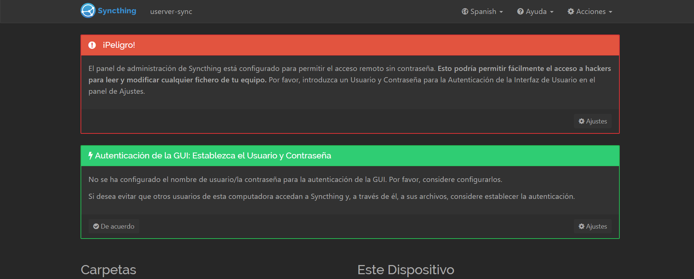

Ok, now we are in the Raspberry pi via web in the browser

Do this **right now** on that Raspberry screen (`192.168.1.X:8384`):

1. Go to top right: **Actions** button > **Show ID**.
2. You will get a QR code and below a long code of letters and numbers.
3. **Copy that long code** and paste it in a temporary notepad (or leave it copied).

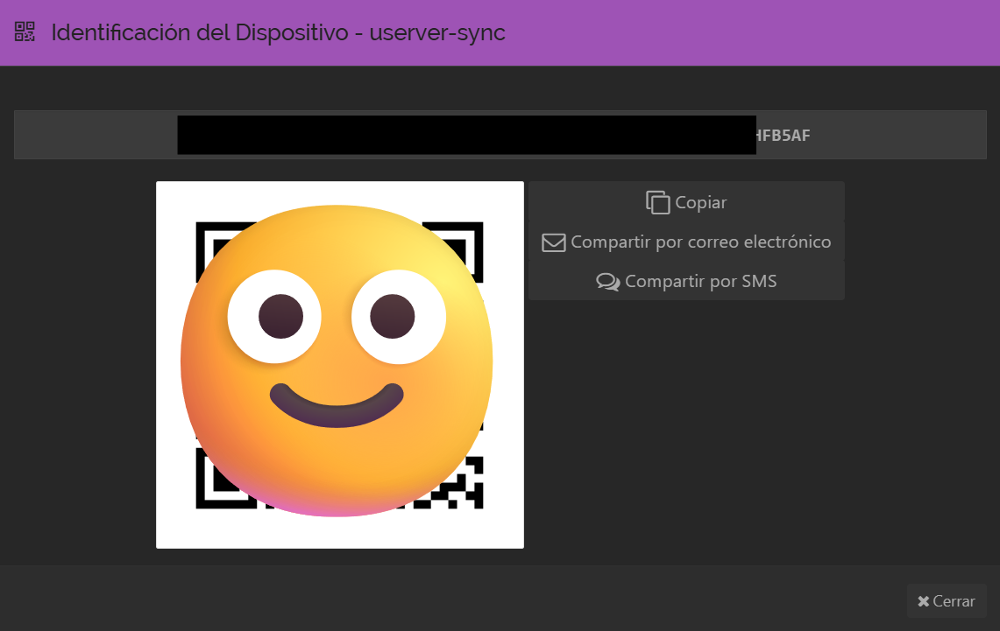

---

## 4. Client Configuration (Windows) and Pairing

### Step 4.1: Add the Server from Windows

1. Open **SyncTrayzor** on your PC.
2. Bottom right, click the **"Add Remote Device"** button.
3. A window will open.
    - **Device ID:** Paste the long code you copied before from the Raspberry Pi.
    - **Device Name:** Write `Raspberry Pi Server`.

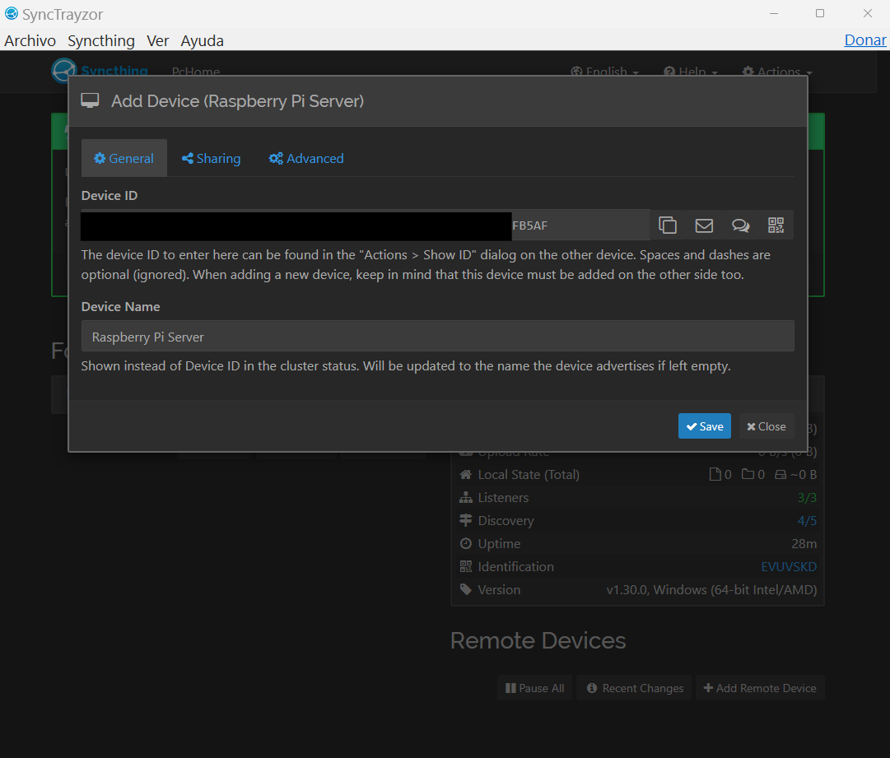

### Step 4.2: Accept the connection on the Server

1. Go back to the browser where you have the Raspberry Pi (`192.168.1.X:8384`).
2. Wait a few seconds. A yellow notice will appear at the top saying: **"New Device XXXXX wants to connect"**.

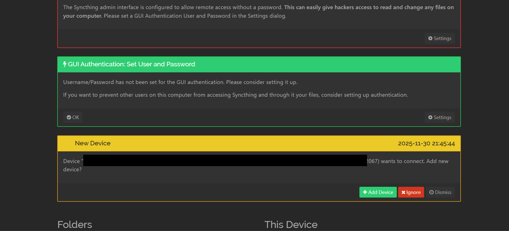

The server receives the pairing request. It is necessary to manually approve it for security.

1. Click the green **Add Device** button.
2. In the window that appears:
    - **Device Name:** Write `PC Windows`.
    - Click **Save**.

1. Now, on both computers, the status **"Connected"** or "Unused" should appear in green.

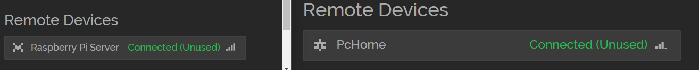

### Step 4.3: Create the shared folder (PC)

1. Find the folder to share or create one with the desired name.
2. Go back to **SyncTrayzor** on your PC.
3. On the left, click **"Add Folder"**.
4. Fill this in:
    - **1. Folder Label:** name of the folder you created
    - **Folder Path:** full path to your folder

> ⚠️ Warning: you must put the path without (“”) or you will have folder identification problems.

1. Go to the top tab **"Sharing"**.
2. Check the box **"Raspberry Pi Server"**.
3. Click **Save**.

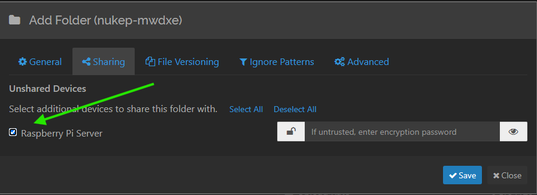

---

### Step 4.4: Map the volume on the Server (CRITICAL)

This is the most important technical step.

1. Go back to the Raspberry Pi browser (`192.168.1.x:8384`).
2. You will see another yellow notice at the top: **"PC Windows wants to share folder 'xxxxxxxxx"**.
3. Click **Add**.

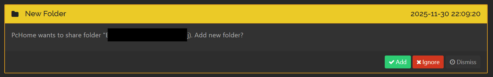

1. A configuration window opens. Look where it says **"Folder Path"**.
    - By default it will say something like `/home/user` or `/config/...`.
    - **DELETE THAT.**
    - Write exactly: `/data1/yourname`
    - *(Remember: `/data1` is the magic door that connects to your SSD hard drive thanks to Docker).*

> ⚠️ IMPORTANT: We modify the destination path to `/data1/` to ensure data is written to the persistent Docker volume (the SSD) and not the SD card.

1. Click **Save**.

---

## 5. Encrypted Cloud Configuration (Rclone)

### Step 5.0: Preparation on the PC (Necessary for the token)

To connect the Pi to Google, you need to generate a "permit" (token) from your Windows PC.

1. Download **Rclone for Windows**: [Direct ZIP link](https://downloads.rclone.org/v1.68.2/rclone-v1.68.2-windows-amd64.zip).
2. Open the ZIP and enter the folder.
3. In the address bar of that folder, write `cmd` and hit Enter. (A black terminal will open in that folder).
4. **Leave it open**, we will use it in a minute.

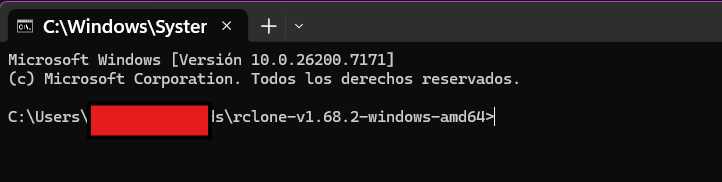

### Step 5.1: Create the connection (SSH on the Pi)

Go back to your Raspberry Pi terminal (`ssh netmiko@...`).

1. Run: `rclone config`
2. Write `n` (New remote) > Enter.
3. **Name:** `gdrive` > Enter.
4. **Storage:** Write `drive` > Enter.
5. **Client ID:** Leave empty > Enter.
6. **Client Secret:** Leave empty > Enter.
7. **Scope:** Write `1` (Full access) > Enter.
8. **Service Account:** Leave empty > Enter.
9. **Edit advanced config:** `n` > Enter.
10. **Use web browser?:** ⚠️ **IMPORTANT:** Write **`n`** (NO).


### Step 5.2: The Authentication Bridge

Now the Pi terminal will tell you something like:
*"Execute the following on the machine with the web browser..."*
and give you a command starting with `rclone authorize "drive" "..."`.

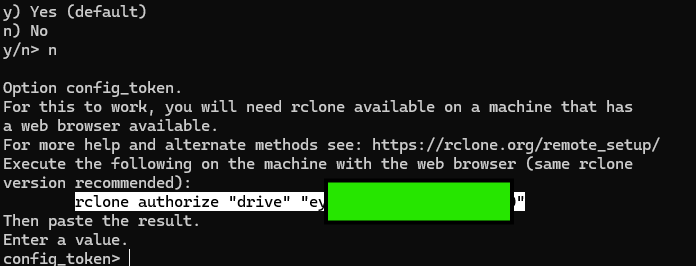

1. **Copy** all that command the Pi gives you.
2. Go to the **black terminal of your Windows PC** (from Step 5.0).
3. **Paste** the command and hit Enter.
4. Your browser will open. Log in with your Google account and click **Allow**.
5. Go back to the Windows black terminal. It will have spat out a giant code (token).
6. **Copy the giant code** (starts and ends with brackets `{...}`).
7. Go back to the **Raspberry Pi** and paste it where it says `config_token>`.
8. **Shared Drive:** `n`.
9. **Keep this remote:** `y`.

---

### Step 5.3: Create the Safe (Encryption)

Do not exit the `rclone config` menu. Now we are going to create the security layer.

1. Write `n` (New remote).
2. **Name:** `gcrypt`
3. **Storage:** Write `crypt`.
4. **Remote:** `gdrive:/Backups_Cifrados` *(This will create that folder in your Drive).*
5. **Filename Encryption:** `1` (Standard).
6. **Directory Name Encryption:** `1` (True).
7. **Password:** `y` (Yes).
    - **Invent a password** (NOT the Gmail one, a new one to encrypt).
    - ⚠️ **WRITE IT DOWN**. If you lose it, goodbye data.
8. **Salt:** Leave empty > Enter.
9. **Keep this remote:** `y`.
10. Exit the menu with `q`.

---

### Step 5.4: Test and Capture

1. Create a test file on the Pi: `touch secret_test.txt`
2. Upload it: `rclone copy secret_test.txt gcrypt:/`
3. If no error, go to your Google Drive in the PC browser.
4. Find the folder `Backups_Cifrados`.

> Verification of 'Zero Knowledge': The uploaded file appears in Google Drive with the name and content encrypted.
> 
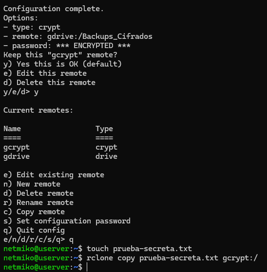
---

## 6. Automation (Script + Cron)

### Step 6.1: Create the "Brain" (The Script)

We are going to write the small program that makes the decisions.
In your Raspberry Pi terminal (`ssh`):

6.1.1. Create/Open the file:

`nano /home/netmiko/scripts/upload_cloud.sh`

**6.1.2. Copy and paste** this exact code (it is the improved version with activity log):

```bash
#!/bin/bash
# Sovereign Vault - Script de Backup Automático

# CONFIGURACIÓN
ORIGEN="/home/netmiko/Backups"
DESTINO="gcrypt:/"
LOGFILE="/home/netmiko/scripts/upload.log"

echo "------------------------------------------------" >> $LOGFILE
echo "INICIO BACKUP: $(date)" >> $LOGFILE

# COMANDO DE SINCRONIZACIÓN
# -v: Verbose (escribe detalles en el log)
# --transfers=4: Sube 4 archivos a la vez para ir más rápido
rclone sync $ORIGEN $DESTINO -v --transfers=4 >> $LOGFILE 2>&1

# COMPROBACIÓN DE ERRORES
if [ $? -eq 0 ]; then
    echo "ESTADO: ÉXITO - $(date)" >> $LOGFILE
else
    echo "ESTADO: ERROR - $(date)" >> $LOGFILE
fi
echo "------------------------------------------------" >> $LOGFILE
```

6.1.3. Save (`Ctrl + O`, `Enter`) and exit (`Ctrl + X`).

---

### Step 6.2: Give Permissions (Make it Executable)

Right now it is just a text file. We have to convert it into a program.

Execute:

```bash
chmod +x /home/youruser/scripts/upload_cloud.sh
```

---

### Step 6.3: Schedule the Clock (Cron)

We are going to tell Linux: "Run this every day at 04:00 AM".

1. Open the task editor:

```bash
crontab -e
```

1. Go to the very end of the file and paste this line:

```bash
0 4 * * * /home/youruser/scripts/upload_cloud.sh
```

1. Save and exit

---

### Step 6.4: The Final Test (Verify the Log)

To be calm that the script works (and not wait until 4 AM), we are going to launch it manually once.

1. Execute the script:

```bash
/home/youruser/scripts/upload_cloud.sh
```

1. Read the log to see the result

```bash
cat /home/youruser/scripts/upload.log
```

**What should you see?**
At the end of the text it should say: **`ESTADO: ÉXITO`**.

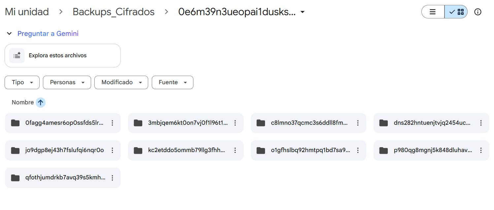
## 🔒 Security & Privacy Philosophy

This project adheres to the principle of **Data Sovereignty**.

* **No Vendor Lock-in:** The local copy is always accessible via standard file systems.
* **Privacy by Design:** Google Drive (or any cloud provider) never sees the actual files, only encrypted blobs.
* **Resilience:** Protection against Ransomware (via versioning) and hardware failure.

---

## 🚀 Roadmap

Future improvements planned for this infrastructure:
- [ ] Add Telegram/Discord notifications on backup failure.
- [ ] Implement a Grafana Dashboard to visualize disk usage and sync status.
- [ ] Add a second offsite location (S3 or MinIO) for redundancy.

---

## 🙌 Acknowledgements & Credits

This project relies on fantastic Open Source software. Special thanks to the creators:

* **[SyncTrayzor](https://github.com/canton7/SyncTrayzor):** Thanks to **Antony Male (@canton7)** for creating the best Syncthing wrapper for Windows.
* **[Syncthing](https://syncthing.net/):** The continuous file synchronization program.
* **[Rclone](https://rclone.org/):** "Rsync for cloud storage", created by **Nick Craig-Wood**.

---

## 👤 Author

**José Álvarez** *| Microcomputer Systems & Networks Technician | Network Automation*

* 📧 [contacto@netmiko.io](mailto:contacto@netmiko.io)
* 💼 [LinkedIn Profile](https://www.linkedin.com/in/jadomin/)
* 🐙 [GitHub Profile](https://github.com/JAlvarez-NetDev)
